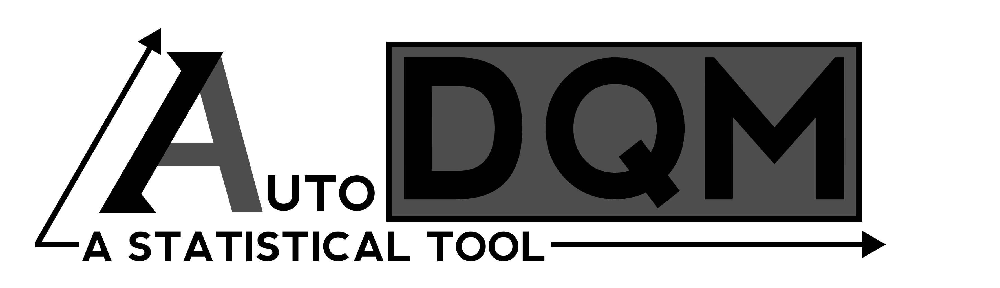
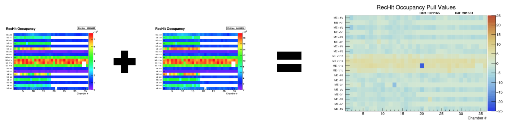
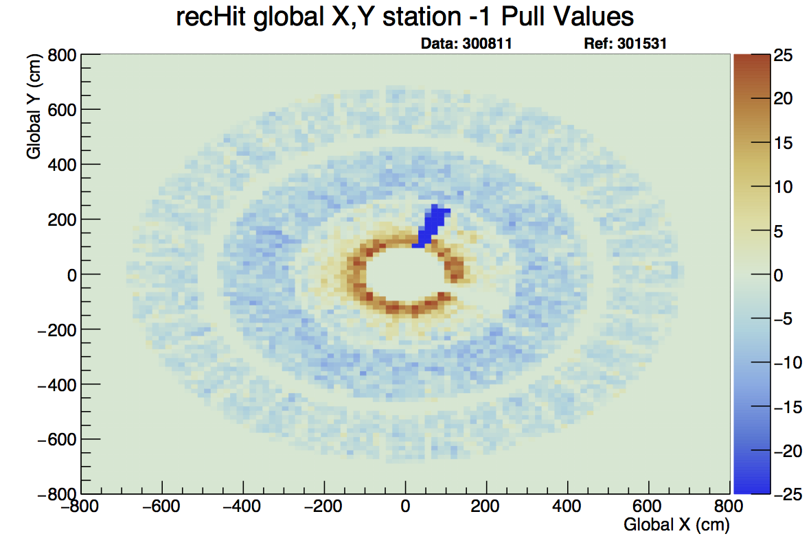
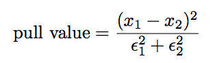
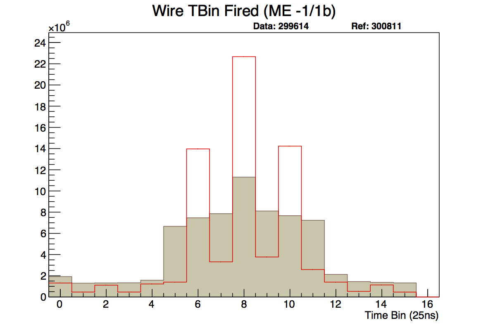
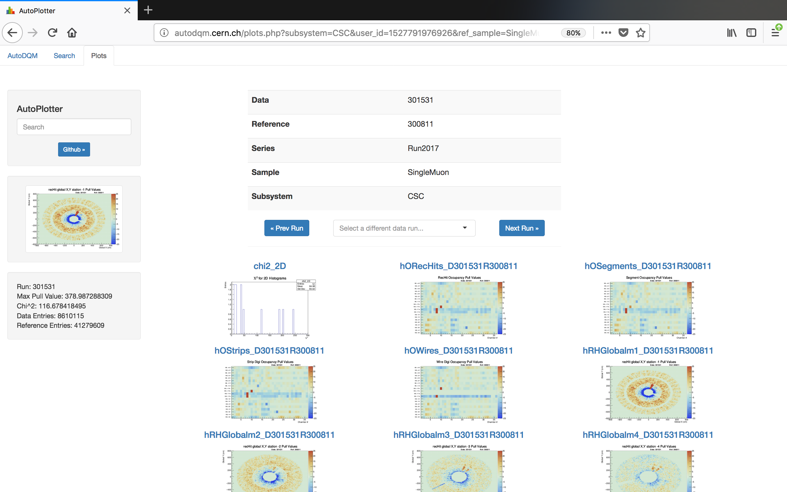

AutoDQM is a statistical tool for Data Quality Management (DQM) at the Large Hadron Particle Collider.

#. `Motivation <https://github.com/jkguiang/AutoDQM/wiki#motivation>`_
#. `The Statistical Arsenal <https://github.com/jkguiang/AutoDQM/wiki#the-statistical-arsenal>`_
#. `Example Output <https://github.com/jkguiang/AutoDQM/wiki#example-output>`_

Motivation
----------

Before AutoDQM, DQM shifters were tasked with looking at hundreds of DQM histograms, looking for hard-to-spot issues in data collection. AutoDQM runs long established statistical tests using ROOT on these graphs and outputs outliers on a simple, but effective, GUI that expedites the shifters' task.

The Statistical Arsenal
-----------------------

AutoDQM uses a variety of long-established statistical tests to determine how similar a "data" run is to a reference run selected by the DQM shifter.

Bin-by-Bin Pull Values
^^^^^^^^^^^^^^^^^^^^^^

For 2D histograms AutoDQM goes bin-by-bin through both the data and reference histograms, then plots the difference between each corresponding bin onto a new, identical histogram, taking proper Poisson errors into account. The equation for this calculation is fairly simple:

where "x" is the bin value and epsilon is the error of that bin value. The code for this can be found `here <https://github.com/jkguiang/AutoDQM/blob/release-v2.0.0/src/AutoDQM.py#L282-L292>`_.

Kolmogorov-Smirnov Test
^^^^^^^^^^^^^^^^^^^^^^^

The Kolmogorov-Smirnov test compares the distance between points on a sample distribution and some reference distribution and qualifies how close or far they are. It is too complex to discuss here, but `Wikipedia <https://en.wikipedia.org/wiki/Kolmogorov%E2%80%93Smirnov_test>`_ has a good article on it. 

Example Output:
---------------

Here, Run 301531 was taken as the 'data' run with Run 300811 as the reference. AutoDQM outputted more readable graphs with clear indications that there are some dead cells.
